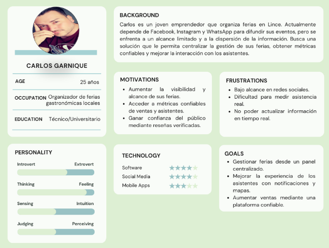
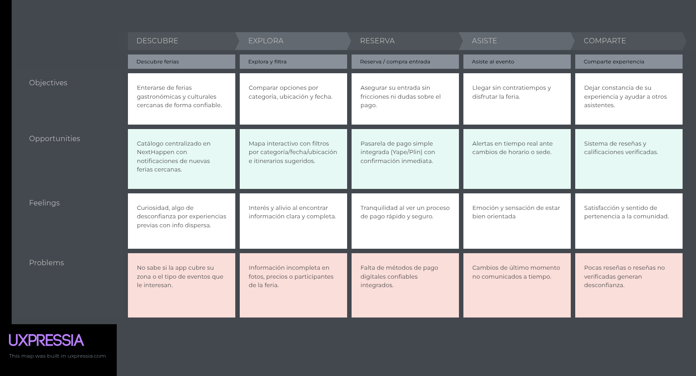
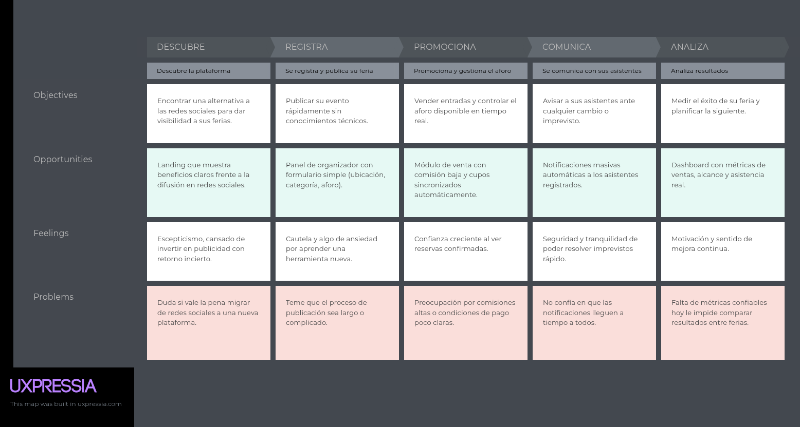
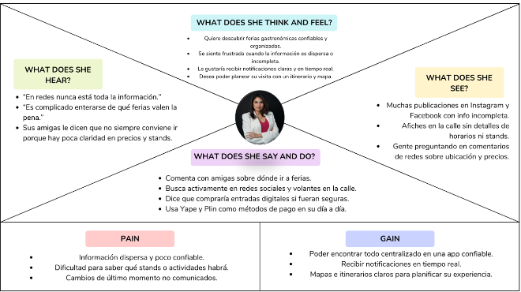
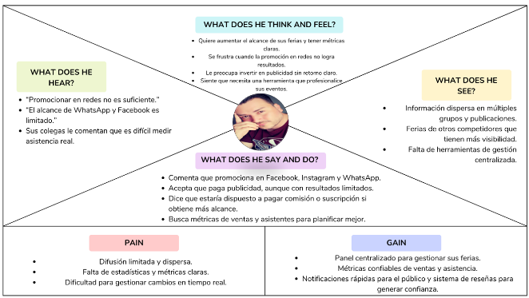

# Capítulo II: Requirements Elicitation & Analysis

## 2.1. Competidores

### 2.1.1. Análisis competitivo

#### Competitive Analysis Landscape

| ¿Por qué llevar a cabo este análisis? | El propósito de este análisis es evaluar las soluciones digitales existentes en el mercado peruano para la difusión y venta de entradas, identificando la brecha de valor que Festora / NextHappen cubrirá en el segmento de ferias y eventos alternativos. |
| :--- | :--- |

| Perfil | NextHappen  | Joinnus  | Atrápalo.pe  | Facebook Events  |
| :--- | :--- | :--- | :--- | :--- |
| **Overview** | Plataforma digital especializada en la geolocalización, difusión y reserva de entradas para ferias independientes y propuestas culturales emergentes en Lima. | Plataforma consolidada en Perú para venta de entradas de conciertos masivos, teatro comercial, conferencias y eventos deportivos corporativos. | Marketplace de ocio, viajes y gastronomía que incluye paquetes turísticos, espectáculos comerciales y reservas en restaurantes. | Módulo social de Meta para la creación, recomendación y confirmación de asistencia a eventos públicos y privados. |
| **Ventaja competitiva** | Geolocalización precisa en tiempo real, alertas de reprogramación y enfoque 100% exclusivo en comunidades culturales independientes de nicho. | Posicionamiento de marca consolidado, soporte de pasarelas de pago bancarias y alta cuota de mercado corporativo. | Programas de fidelización, descuentos cruzados con aerolíneas/hoteles y catálogo diverso de paquetes de ocio. | Red social con base masiva de usuarios interconectados y costo cero para crear convocatorias. |
| **Mercado objetivo** | Jóvenes y adultos de 18 a 35 años (NSE A, B, C+) y colectivos feriales independientes en Lima Metropolitana. | Público masivo consumidor de espectáculos multitudinarios, producciones teatrales y empresas corporativas. | Consumidores de entretenimiento familiar, turistas locales y usuarios que buscan promociones de fin de semana. | Usuarios generales de Facebook e Instagram con perfiles de todas las edades. |
| **Estrategias de marketing** | Alianzas con colectivos artísticos, difusión en ferias locales y marketing de contenidos en comunidades culturales urbanas. | Pauta publicitaria digital intensiva, patrocinios de eventos multitudinarios y convenios corporativos de ticketing. | Email marketing segmentado por ofertas de temporada, pauta en Google Ads y alianzas bancarias. | Difusión orgánica mediante el feed social, notificaciones de amigos que asistirán y sugerencias algorítmicas. |
| **Productos & Servicios** | Catálogo con mapa interactivo, sistema de preventa con bajas comisiones, alertas en tiempo real y panel analítico ferial. | Venta de tickets digitales, control de accesos con códigos QR, gestión de asientos numerados y pauta promocional. | Venta de entradas, reservas gastronómicas, paquetes turísticos y venta de vouchers de descuento. | Creación de páginas de eventos, foros de discusión, calendario sincronizado y métricas básicas de engagement. |
| **Precios & Costos** | Comisión baja por boleto vendido (6% - 9%) y suscripción opcional para analítica avanzada de organizadores. | Comisión por ticket vendido de entre 10% y 15% más cargos por servicio transferidos al usuario final. | Comisiones variables de intermediación por reserva confirmada y tarifas de membresía a comercios. | Gratuito para crear y publicar; cobro por pauta publicitaria (Facebook Ads) para aumentar el alcance. |
| **Canales de distribución** | Aplicación web responsive (Web Browser y Mobile Browser). | Plataforma web y aplicaciones móviles nativas para Android e iOS. | Sitio web responsivo y aplicación móvil. | Aplicación móvil de Facebook e interfaz web. |

#### Análisis SWOT Comparativo de la Competencia

| Dimensión FODA | NextHappen | Joinnus | Atrápalo.pe | Facebook Events |
| :--- | :--- | :--- | :--- | :--- |
| **Fortalezas** | Especialización en eventos de nicho; mapa interactivo en tiempo real; cercanía y accesibilidad para organizadores autogestionados. | Dominio y reconocimiento del mercado de ticketing; confianza bancaria absoluta; infraestructura tecnológica robusta. | Marca asociada a promociones y descuentos; catálogo amplio de entretenimiento y gastronomía. | Efecto de red masivo; gratuidad en la publicación; integración inmediata con calendarios móviles. |
| **Debilidades** | Marca novel en fase de introducción; base de usuarios inicial reducida; necesidad de validación de confianza. | Comisiones altas y restricciones contractuales inviables para ferias pequeñas; nula visibilidad para autogestión. | Enfoque disperso; interfaz web saturada; nula cobertura de ferias independientes o colectivos underground. | Alcance orgánico deliberadamente castigado por el algoritmo; alta presencia de spam y datos desactualizados. |
| **Oportunidades** | Capturar el 70% de colectivos feriales que operan informalmente en redes sociales; auge del consumo cultural urbano. | Expansión hacia eventos corporativos híbridos y streaming en vivo. | Incorporar experiencias feriales gastronómicas independientes dentro de sus paquetes de ocio. | Integrar pasarelas de pago directas para reservas sin derivar a enlaces externos. |
| **Amenazas** | Copia de funcionalidades por plataformas grandes; resistencia inicial al pago digital en ferias independientes. | Entrada de plataformas globales de ticketing (ej. Ticketmaster, Eventbrite) al mercado peruano. | Disminución del gasto de los hogares en ocio no esencial debido a recesiones económicas. | Migración de los usuarios jóvenes hacia redes visuales como TikTok, reduciendo el tráfico de Facebook. |

- **Evaluación estratégica:** Mientras Joinnus domina los eventos comerciales y Facebook Events sufre de desinformación algorítmica, NextHappen capitaliza la debilidad de ambos al ofrecer una plataforma curada, geolocalizada y con tarifas justas para la escena independiente limeña.

### 2.1.2. Estrategias y tácticas frente a competidores

- **Estrategia de Penetración en el Ecosistema Cultural:** Frente a la fortaleza de Joinnus (infraestructura) y Facebook (gratuidad), NextHappen aplicará como táctica un modelo de comisiones reducidas (6% frente al 12% de Joinnus) durante el primer año y acompañamiento técnico directo a los colectivos feriales para digitalizar sus accesos.
- **Táctica de Curaduría y Confianza Informativa:** Frente a la desinformación de Facebook Events, la plataforma implementará verificación de identidad de organizadores y actualización geolocalizada obligatoria, garantizando que el usuario solo encuentre eventos reales y vigentes.
- **Estrategia de Fidelización de Nicho:** Frente al enfoque disperso de Atrápalo, NextHappen enfocará su marketing en alianzas con casas culturales de Barranco, Centro de Lima y Miraflores, convirtiéndose en el canal exclusivo de la movida alternativa urbana.

## 2.2. Entrevistas

### 2.2.1. Diseño de entrevistas

#### Preguntas Generales (Demográficas y Contexto)

1. ¿Cuál es su nombre completo, edad, ocupación y distrito de residencia?
2. ¿Qué dispositivos móviles y navegadores web utiliza con mayor frecuencia en su día a día?
3. ¿Cuáles son sus marcas, pasatiempos o actividades de ocio favoritas durante los fines de semana?

#### Preguntas para Asistentes a Ferias y Eventos Alternativos

1. ¿Con qué frecuencia asiste a ferias de diseño, bazares gastronómicos o eventos culturales independientes en Lima?
2. ¿Qué medios o canales digitales consulta para enterarse de este tipo de actividades?
3. ¿Cuáles son los principales problemas o frustraciones que experimenta al buscar información sobre una feria?
4. ¿Qué datos considera estrictamente indispensables antes de decidir asistir a un evento ferial?
5. ¿Alguna vez ha llegado a un evento que cambió de horario, local o fue cancelado sin previo aviso? ¿Cómo impactó su experiencia?
6. ¿Estaría dispuesto a adquirir o reservar sus entradas a través de una plataforma web? ¿Qué medios de pago prefiere?

#### Preguntas para Organizadores y Emprendedores Culturales

1. ¿Qué tipo de eventos o ferias organiza y cuál es el aforo promedio que maneja?
2. ¿Cómo gestiona actualmente la difusión de sus convocatorias y qué limitaciones encuentra en las redes sociales?
3. ¿Cómo administra la preventa de entradas y el control de asistencia al recinto?
4. ¿Qué métricas de asistencia o ventas le gustaría conocer para optimizar sus siguientes ediciones?
5. ¿Estaría dispuesto a pagar una comisión porcentual accesible o suscripción por una herramienta que centralice la venta y difusión de su evento?
6. ¿Qué funciones consideraría indispensables en un panel de control para organizadores?

### 2.2.2. Registro de entrevistas

#### Segmento 1: Asistentes a Ferias y Eventos Alternativos

##### Entrevista 1

- **Entrevistado:** Darío Salvador
- **Edad:** 23 años | **Distrito:** San Miguel
- **Perfil:** Estudiante universitario, usuario intensivo de iOS y Chrome. Le apasionan los bazares de ilustración y la música indie.
- **Evidencia:** 
[Enlace al Video en Microsoft Stream / OneDrive](https://upcedupe-my.sharepoint.com/:v:/g/personal/u202210720_upc_edu_pe/IQDgKORi-5WmSZT3uhYNiWvAAakLVbBjM-TODal_YLVxhkY?nav=eyJyZWZlcnJhbEluZm8iOnsicmVmZXJyYWxBcHAiOiJPbmVEcml2ZUZvckJ1c2luZXNzIiwicmVmZXJyYWxBcHBQbGF0Zm9ybSI6IldlYiIsInJlZmVycmFsTW9kZSI6InZpZXciLCJyZWZlcnJhbFZpZXciOiJNeUZpbGVzTGlua0NvcHkifX0&e=qyOqct) (Timestamp: 00:00 - Duración: 02:35) https://shorturl.at/PlIuD
- **Captura:**  
- **Resumen descriptivo:** Darío señala que busca ferias a través de historias de Instagram, pero las publicaciones desaparecen a las 24 horas y rara vez detallan si aceptan tarjeta o el costo de ingreso. En dos ocasiones acudió a ferias en Barranco que habían cambiado de sede debido a fiscalización municipal, perdiendo tiempo y dinero en transporte. Valora una solución que tenga mapa interactivo y pasarelas de pago mediante billeteras móviles (Yape/Plin).

#### Segmento 2: Organizadores y Colectivos Feriales

##### Entrevista 2

- **Entrevistado:** Juan Carlos Alvarado
- **Edad:** 26 años | **Distrito:** Callao
- **Perfil:** Productor cultural independiente de ferias de arte emergente con aforos de 150 personas.
- **Evidencia:** [Enlace al Video en Microsoft Stream / OneDrive](https://upcedupe-my.sharepoint.com/:v:/g/personal/u202210720_upc_edu_pe/IQB7NSr1yl28SoLwTIBJkofDAUO8TNNAUTQSXsEenv8zBZw?e=8gIW7T&nav=eyJyZWZlcnJhbEluZm8iOnsicmVmZXJyYWxBcHAiOiJTdHJlYW1XZWJBcHAiLCJyZWZlcnJhbFZpZXciOiJTaGFyZURpYWxvZy1MaW5rIiwicmVmZXJyYWxBcHBQbGF0Zm9ybSI6IldlYiIsInJlZmVycmFsTW9kZSI6InZpZXcifX0%3D) (Timestamp: 00:00 - Duración: 02:16) https://shorturl.at/Myy9j
- **Captura:**  
- **Resumen descriptivo:** Juan Carlos indica que invierte en publicidad de Instagram pero el alcance ha caído drásticamente. Gestiona las preventas enviando su número de Yape por mensaje directo y apuntando en hojas de cálculo, lo que le demanda horas y ocasiona errores de duplicidad. Aceptaría pagar hasta un 8% de comisión a cambio de un panel que automatice los accesos y le permita enviar avisos masivos a los inscritos.

### 2.2.3. Análisis de entrevistas

### Segmento: Organizadores / Emprendedores

#### Características objetivas

- El 80% promociona sus eventos principalmente en redes sociales.
- El 70% utiliza más de un canal de difusión.
- El 60% no cuenta con herramientas formales de gestión.
- El 75% está dispuesto a pagar por mayor visibilidad.

#### Características subjetivas

- El 85% percibe bajo alcance orgánico en redes sociales.
- El 70% tiene dificultades para llegar a su público objetivo.
- El 80% considera importante contar con métricas claras.
- El 65% prefiere herramientas simples y prácticas.

#### Análisis

Los organizadores dependen de las redes sociales, pero no están satisfechos con sus resultados. Buscan mayor visibilidad, métricas claras y herramientas simples de gestión.

---

### Segmento: Asistentes a ferias y eventos

#### Características objetivas

- El 85% descubre eventos mediante redes sociales.
- El 65% se guía por recomendaciones de terceros.
- El 75% usa smartphones para buscar actividades.
- El 80% está dispuesto a comprar entradas digitales.

#### Características subjetivas

- El 80% percibe información incompleta o desactualizada.
- El 75% valora información clara.
- El 70% desea recomendaciones personalizadas.
- El 85% muestra interés en notificaciones cercanas.

#### Análisis

Los usuarios buscan experiencias, pero enfrentan dificultades por la falta de información centralizada. Valoran la facilidad, la confianza y la personalización.

## 2.3. Needfinding

### 2.3.1. User Personas

### 2.3.2. User Task Matrix

### Segmento 1 - Usuario

| Tarea | Frecuencia | Importancia |
|---|---|---|
| Buscar información sobre ferias | Often | High |
| Ubicar ferias en un mapa | Often | High |
| Comprar entradas online | Occasionally | High |
| Recibir notificaciones en tiempo real | Often | High |
| Consultar reseñas de asistentes | Occasionally | Medium |

---

### Segmento 2 - Organizador

| Tarea | Frecuencia | Importancia |
|---|---|---|
| Promocionar ferias en la plataforma | Often | High |
| Actualizar información en tiempo real | Often | High |
| Consultar métricas | Occasionally | High |
| Gestionar ferias desde un panel | Occasionally | High |
| Recibir feedback de asistentes | Occasionally | Medium |

### 2.3.3. User Journey Mapping

Segmento 1 - Usuario

Segmento 2 - Organizador

### 2.3.4. Empathy Mapping

Segmento 1 - Usuario

Segmento 2 - Organizador

### 2.3.5. As-is Scenario Mapping

### Segmento 1 - Dario Salvador

| Phases | Buscar Información | Planificar la visita | Asistir a la feria | Compartir experiencia |
|---|---|---|---|---|
| **Doing** | Revisa Instagram y Facebook. | Anota horarios y ubicaciones. | Sigue direcciones desde redes. | Comenta experiencia con amigos. |
| **Thinking** | ¿Dónde encuentro información confiable? | ¿Dónde está exactamente el evento? | ¿Qué horarios tienen las actividades? | ¿Valdrá la pena recomendarla? |
| **Feeling** | Frustración por información dispersa. | Ansiedad y confusión. | Emoción por asistir. | Satisfacción o molestia según experiencia. |

---

### Segmento 2 - Juan Carlos Alvarado

| Phases | Buscar Información | Planificar la visita | Asistir a la feria | Compartir experiencia |
|---|---|---|---|---|
| **Doing** | Publica en Facebook e Instagram. | Recibe mensajes manualmente. | Estima asistentes por likes. | Publica cambios rápidamente. |
| **Thinking** | ¿Cómo llegar a más personas? | ¿Cuántas entradas se vendieron? | ¿Vale la pena invertir más? | ¿Cómo evitar frustración? |
| **Feeling** | Preocupación por bajo alcance. | Agobio por gestión manual. | Inseguridad por falta de métricas. | Estrés por cambios de último momento. |

## 2.4. Ubiquitous Language

- Attendee (Asistente): Persona de 18 a 35 años que utiliza la plataforma NextHappen para descubrir, buscar y reservar acceso a ferias y eventos culturales alternativos en Lima Metropolitana.
- Organizer (Organizador): Colectivo, emprendedor o productor cultural independiente que publica y gestiona sus ferias o eventos en la plataforma, controla el aforo y se comunica con los asistentes registrados.
- Event / Fair (Evento / Feria): Actividad cultural, gastronómica, de diseño o artística de pequeña o mediana escala (50 a 600 personas de aforo) publicada por un organizador, con ubicación, fecha, horario, categoría y capacidad definidas.
- Category (Categoría): Clasificación temática de un evento (por ejemplo, gastronomía, diseño, música, arte) utilizada para filtrar el catálogo y personalizar recomendaciones.
- Location (Ubicación): Coordenadas geográficas (latitud/longitud) y dirección asociadas a un evento, utilizadas para su visualización en el mapa interactivo y para búsquedas por proximidad.
- Interactive Map (Mapa Interactivo): Vista geolocalizada del catálogo de eventos que permite a los asistentes explorar ferias cercanas y filtrarlas por categoría, fecha o ubicación.
- Capacity / Attendance Cap (Aforo): Número máximo de asistentes permitido en un evento, gestionado por el organizador para evitar la saturación del recinto y sincronizar la disponibilidad de entradas.
- Ticket (Entrada / Ticket): Comprobante digital de acceso a un evento, generado tras una compra o reserva confirmada, con estado (válido, usado, cancelado) y código de validación (QR).
- Booking (Reserva): Proceso mediante el cual un asistente aparta o adquiere una entrada para un evento, sujeto a la disponibilidad de aforo.
- Ticket Validation (Validación de Ticket): Verificación del código de la entrada digital al ingreso del evento, realizada por el organizador para controlar el acceso.
- Notification / Alert (Notificación / Alerta): Mensaje automático enviado a los asistentes registrados en un evento para informar cambios de horario, sede, cancelaciones u otra información operativa relevante en tiempo real.
- Recommendation (Recomendación): Sugerencia personalizada de eventos mostrada a un asistente en función de sus intereses declarados o su historial de interacción en la plataforma.
- Review / Rating (Reseña / Calificación): Comentario y puntuación dejados por un asistente verificado tras acudir a un evento, utilizados para construir la reputación del organizador y del evento.
- Organizer Dashboard (Panel del Organizador): Vista de gestión donde el organizador crea y edita eventos, controla el aforo y las reservas, y consulta métricas de desempeño (ventas, alcance, asistencia).
- Event Detail (Ficha del Evento): Página con la información completa de un evento (descripción, ubicación, horario, precio, aforo disponible) que el asistente consulta antes de reservar o comprar.
- No-show (Inasistencia): Caso en que un asistente adquiere una entrada pero no se presenta al evento; métrica clave para evaluar la efectividad de las alertas y notificaciones.
- Initial Segment / Early Adopter (Segmento Inicial): Subconjunto de usuarios (asistentes de 18–30 años con alta frecuencia de asistencia, u organizadores con aforos de 50–500 personas) priorizado para la validación temprana de hipótesis del producto.