# Capítulo IV: Product Design

## 4.1. Style Guidelines

En esta sección se establecen los lineamientos visuales que definen la identidad de NextHappen, así como su aplicación concreta en la interfaz web y la aproximación planteada para las futuras interfaces móviles (iOS y Android).

### 4.1.1. General Style Guidelines

Esta sección define los lineamientos visuales fundamentales del proyecto: paleta de colores, tipografía y elementos gráficos, extraídos del panel del organizador y del flujo de autenticación implementados actualmente.

#### Colores cromáticos

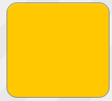

**#FFC800 (Amarillo Vibrante – Principal)**
Es el color de acento principal de la marca. Se utiliza en botones de acción primaria ("+ Nuevo", "Select Photos", "Search"), en la tarjeta de KPI más importante ("Ingresos Netos") y en detalles decorativos como el ícono del logo. Transmite energía, dinamismo y entusiasmo, valores asociados a la idea de descubrir eventos y ferias.


**#000000 (Negro – Estructural)**
Se usa como color estructural en bordes gruesos (2px) de tarjetas, botones, inputs e íconos, así como en la tipografía principal. Este uso extendido del negro le da a la interfaz un carácter gráfico, sólido y de alto contraste.

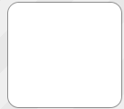

**#FFFFFF (Blanco – Superficies)**
Color base de tarjetas, formularios y botones secundarios. Aporta limpieza y permite que el contraste con los bordes negros resalte cada componente de forma independiente.

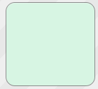

**#D7F5E3 (Verde Menta – Estado positivo)**
Utilizado en la tarjeta de "Validadas · Asistencia" para comunicar estados positivos o de confirmación (validación de entradas, asistencia registrada).

#### Colores acromáticos

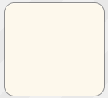

**#FDF8EC (Crema – Fondo general)**
Color de fondo de toda la aplicación. Genera un ambiente cálido y cercano, evitando la frialdad de un blanco puro y funcionando como lienzo neutro para que resalten el amarillo y el negro.

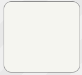

**#F5F5F0 / Gris cálido (Superficies secundarias)**
Utilizado en placeholders de imágenes, áreas de carga de archivos y elementos no interactivos, manteniendo la calidez de la paleta general.

#### Tipografía

Se emplea la tipografía Inter para títulos y elementos de acción ("Sign In", "Hola, Ferias Lima", nombres de botones), reforzando la sensación de solidez y confianza. Para textos secundarios, subtítulos y descripciones se utiliza la misma familia tipográfica en peso regular, priorizando la legibilidad.

- **Peso Bold:** Títulos, botones, KPIs y nombres de eventos.
- **Peso Regular:** Descripciones, subtítulos, placeholders y textos de apoyo.

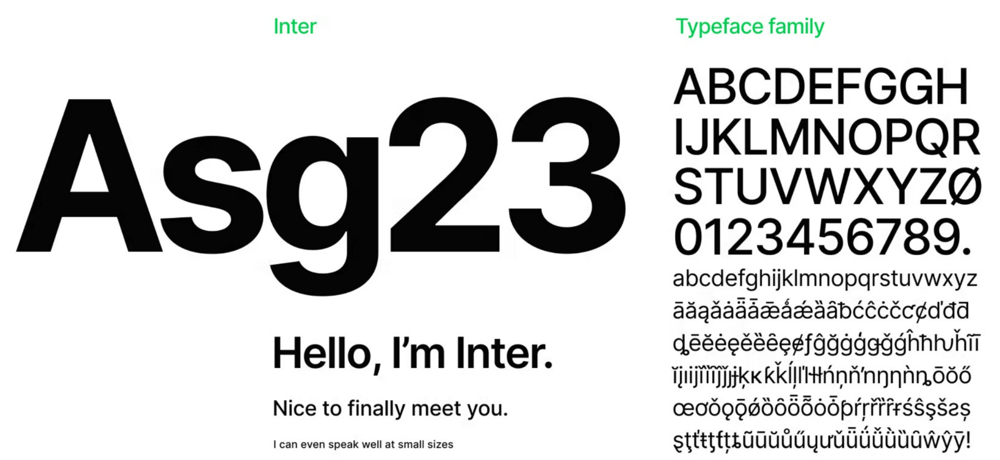

#### Ícono / logotipo

El logotipo de NextHappen combina un ícono cuadrado (a modo de "ticket" o "credencial" estilizado) junto al nombre de la marca en tipografía bold negra. El ícono utiliza el amarillo de marca sobre un contorno negro, replicando el lenguaje visual del resto de la interfaz (bordes gruesos, alto contraste). Este logo comunica de forma directa la naturaleza del producto: acceso y descubrimiento de eventos.


### 4.1.2. Web Style Guidelines

En esta sección se muestra la aplicación de los lineamientos antes descritos sobre las pantallas actuales de la plataforma web de NextHappen.

En la pantalla de **Sign In**, se aprecia el uso de tarjetas con bordes negros gruesos sobre fondo crema, botones de selección de rol ("User" / "Organizer") con el mismo lenguaje de bordes, y un botón principal de acción en negro sólido con texto blanco en mayúsculas, siguiendo la jerarquía visual definida.

En el **Panel del Organizador**, la barra superior concentra los accesos rápidos (idioma, métricas, papelera, crear evento, calendario, ingresos, validación QR, notificaciones) como íconos individuales dentro de contenedores cuadrados de borde negro, manteniendo consistencia con el resto del sistema. Las tarjetas de KPIs (Ingresos Netos, Mis Eventos, Entradas Vendidas, Validadas/Asistencia) utilizan color para jerarquizar la información más relevante (amarillo para ingresos, verde para validación), mientras que las tarjetas de acción rápida (Crear evento, Ver ventas, Validar entradas, Mis eventos) combinan ícono + título + descripción breve.

El formulario de **publicación de feria (Publish Fair)** reutiliza el mismo sistema de inputs de borde negro sobre fondo blanco, con placeholders descriptivos en gris, y un área de carga de fotos con estado vacío ilustrado mediante un ícono y un botón de acción en amarillo. La sección de ubicación integra un buscador de direcciones y un mapa embebido para la selección geográfica del evento.

### 4.1.3. Mobile Style Guidelines

A continuación se detalla los lineamientos del diseño de la aplicación movil de NextHappen.

Los lineamientos generales que se mantendrán en ambas plataformas móviles son:

- Uso de la misma paleta de colores (amarillo #FFC800, negro y crema de fondo).
- Bordes marcados en componentes interactivos, adaptados al grosor recomendado por cada guía nativa.
- Tarjetas de evento con imagen, categoría, fecha y precio, replicando la estructura ya usada en "Tus eventos" de la web.
- Botones de acción primaria en amarillo con texto negro/blanco de alto contraste, y botones secundarios en negro sólido.

#### 4.1.3.1. iOS Mobile Style Guidelines

Para la versión iOS se plantea seguir las convenciones de **Human Interface Guidelines (HIG)** de Apple, adaptando el sistema visual de NextHappen de la siguiente manera:

- **Tipografía:** Se utilizará SF Pro (fuente del sistema) en los pesos Bold y Regular, respetando la jerarquía tipográfica ya definida (títulos y KPIs en bold, descripciones en regular), garantizando compatibilidad con Dynamic Type para accesibilidad.
- **Navegación:** Uso de un Tab Bar inferior para las secciones principales (Explorar, Mapa, Entradas, Perfil), en lugar de la barra de íconos superior utilizada en la web, respetando el patrón de navegación estándar en iOS.
- **Componentes:** Botones con esquinas ligeramente redondeadas (siguiendo el estándar de iOS) mientras se conservan los bordes negros marcados como firma visual de la marca. Uso de Sheets modales (bottom sheets nativos) para flujos como la compra de entradas o el detalle de un evento.
- **Iconografía:** Uso de SF Symbols combinados con los íconos personalizados de Apple (ticket, mapa, notificaciones) para mantener coherencia con el sistema operativo sin perder identidad propia.
- **Modo oscuro:** Se contempla una variante en modo oscuro que reemplace el fondo crema por un gris oscuro neutro, conservando el amarillo de marca como acento constante.

#### 4.1.3.2. Android Mobile Style Guidelines

Para la versión Android se plantea seguir los principios de **Material Design 3** de Google, adaptados a la identidad visual de NextHappen:

- **Tipografía:** Se utilizará Roboto en los pesos Bold y Regular, manteniendo la misma jerarquía visual que en la versión web e iOS.
- **Navegación:** Uso de una Bottom Navigation Bar con las secciones principales del sistema (Explorar, Mapa, Entradas, Perfil), acompañada de un Floating Action Button (FAB) en amarillo de marca para la acción principal del rol activo (por ejemplo, "Crear evento" para organizadores).
- **Componentes:** Se adoptan los componentes de Material (Cards, Chips para categorías, Text Fields con borde) pero conservando el grosor de borde y el alto contraste negro/amarillo característico de NextHappen, en lugar de las elevaciones y sombras por defecto de Material.
- **Iconografía:** Uso de Material Symbols combinados con los íconos propios de la marca, priorizando la claridad y el reconocimiento rápido de acciones (validar entrada, ver métricas, notificaciones).
- **Adaptabilidad:** Se contempla el soporte para distintos tamaños de pantalla y densidades, siguiendo las guías de Material sobre breakpoints y grillas responsivas.

## 4.2. Information Architecture

En esta sección se muestran las decisiones de Arquitectura de Información tomadas para organizar el contenido de NextHappen, de manera que tanto los asistentes a eventos como los organizadores puedan navegar la plataforma de forma eficiente. Se incluyen los Organization Systems, Labeling Systems, SEO Tags and Meta Tags, Searching Systems y Navigation Systems.

### 4.2.1. Organization Systems

En este punto se muestran los tipos de estructura de información definidos para cada segmento objetivo de NextHappen.

**Segmento objetivo 1: Asistentes a ferias y eventos**

Al acceder a la plataforma, los visitantes pueden explorar eventos sin necesidad de registrarse, pero para acciones como comprar entradas, guardar favoritos o recibir notificaciones deben iniciar sesión, registrarse o recuperar su contraseña seleccionando el tipo de cuenta "User". Una vez autenticados, acceden a un panel personalizado organizado por categorías de eventos (Arte y Diseño, Gastronomía, entre otras), donde pueden filtrar por fecha, ubicación y tipo de feria, ver el detalle de cada evento y proceder a la compra de su entrada digital.

**Segmento objetivo 2: Organizadores de ferias y eventos**

Al acceder a la plataforma seleccionando el tipo de cuenta "Organizer", los organizadores inician sesión, se registran o recuperan su contraseña. Una vez autenticados, se les presenta el **Panel del Organizador**, estructurado en torno a cuatro bloques de información: métricas generales (ingresos netos, eventos publicados, entradas vendidas, asistencia validada), accesos directos a acciones frecuentes (crear evento, ver ventas, validar entradas, gestionar eventos) y el listado de "Tus eventos" con su estado de ventas. Desde este panel pueden acceder al formulario de publicación de una nueva feria, donde ingresan nombre de la organización, título, descripción, precio, cupo, categoría, fotografías y ubicación geográfica del evento.

### 4.2.2. Labeling Systems

El sistema de etiquetado de NextHappen busca ser directo y descriptivo, priorizando términos ya familiares para ambos segmentos de usuario.

**Selector de tipo de cuenta (Sign In):**

- "User": Acceso para asistentes que buscan y compran entradas a eventos.
- "Organizer": Acceso para quienes publican y gestionan ferias en la plataforma.

**Barra superior del Panel del Organizador:**

- Ícono de idioma: Cambia el idioma de la interfaz.
- Ícono de métricas: Redirige al resumen de estadísticas generales.
- Ícono de papelera: Acceso a eventos eliminados o descartados.
- Ícono "+": Acceso directo a la creación de un nuevo evento.
- Ícono de calendario: Vista de eventos organizados por fecha.
- Ícono "$": Acceso al resumen de ingresos.
- Ícono QR: Acceso a la validación de entradas mediante escaneo.
- Ícono de campana: Centro de notificaciones.

**Tarjetas de métricas (Panel del Organizador):**

- "Ingresos Netos": Total de ingresos generados por ventas de entradas.
- "Mis Eventos": Cantidad total de eventos publicados por el organizador.
- "Entradas Vendidas": Total de entradas vendidas a la fecha.
- "Validadas · Asistencia": Total de entradas validadas al ingreso del evento.

**Acciones rápidas (Panel del Organizador):**

- "Crear evento": Publica una nueva feria.
- "Ver ventas": Muestra ingresos y métricas de ventas.
- "Validar entradas": Habilita el control de acceso al evento.
- "Mis eventos": Permite editar y gestionar eventos existentes.

**Formulario "Publish Fair":**

- "Organization Name": Nombre de la organización o marca del organizador.
- "Title": Nombre del evento o feria.
- "Description": Breve descripción del evento.
- "Price": Precio de la entrada (o "Free" si es gratuito).
- "Quantity": Cupo disponible (o "Unlimited").
- "Category": Categoría temática del evento.
- "Photos": Imágenes representativas del evento.
- "Search address": Búsqueda de la dirección física del evento.

Cada etiqueta fue definida priorizando la claridad y evitando tecnicismos, de modo que tanto un usuario que compra entradas por primera vez como un organizador que publica su primer evento puedan comprender rápidamente cada acción disponible.

### 4.2.3. SEO Tags and Meta Tags

En esta sección se muestran los Meta Tags a utilizar dentro del landing page y la aplicación web de NextHappen.

```
<title>NextHappen | Descubre ferias y eventos alternativos en Lima</title>
<meta name="description" content="NextHappen es la plataforma que conecta a los limeños con ferias independientes, eventos alternativos y propuestas culturales emergentes, permitiendo comprar entradas y recibir alertas en tiempo real.">
<meta name="keywords" content="ferias Lima, eventos alternativos, entradas digitales, ferias independientes, cultura Lima, eventos gastronómicos, arte y diseño">
<meta property="og:title" content="NextHappen | Descubre ferias y eventos alternativos en Lima">
<meta property="og:description" content="Encuentra, compra y comparte entradas para ferias y eventos alternativos cerca de ti.">
<meta property="og:type" content="website">
```

### 4.2.4. Searching Systems

Esta sección presenta el sistema de búsqueda planteado para la plataforma, diseñado en torno a las necesidades de descubrimiento de eventos alternativos en Lima.

***1. ¿Qué se busca?***

El sistema de búsqueda tiene como objetivo permitir a los usuarios encontrar de forma rápida y confiable ferias y eventos alternativos según su ubicación, categoría de interés (Arte y Diseño, Gastronomía, entre otras) y rango de fechas, reduciendo el tiempo invertido en buscar información dispersa en redes sociales.

***2. ¿Qué resultados se mostrarán?***

Los resultados se presentarán como tarjetas de evento que incluyen imagen, nombre, categoría, fecha, ubicación aproximada, precio y disponibilidad de cupos, priorizando primero los eventos más cercanos en fecha y ubicación al usuario.

***3. Interfaz de búsqueda***

La interfaz de búsqueda estará disponible desde el mapa interactivo y desde un buscador por texto libre, permitiendo filtrar los resultados por categoría, fecha y distrito. Se contempla además un buscador de direcciones (como el usado en el formulario "Publish Fair") reutilizable para que los usuarios ubiquen eventos cercanos a un punto de referencia específico.

### 4.2.5. Navigation Systems

Se ha decidido aplicar un Navigation System centrado en las tareas de cada segmento de usuario dentro de la aplicación, tomando como base la barra de accesos rápidos ya implementada en el Panel del Organizador.

Dentro del perfil de Usuario (Asistente):

- Explorar eventos
  * Buscar por categoría
  * Buscar por mapa
- Detalle del evento
- Compra de entradas
- Mis entradas (historial y entrada digital)
- Favoritos
- Notificaciones
- Perfil

Dentro del perfil de Organizador:

- Panel del organizador (resumen de métricas)
- Crear evento
- Mis eventos
  * Editar evento
  * Gestionar cupos
- Ver ventas
- Validar entradas (QR)
- Notificaciones
- Perfil

## 4.3. Landing Page UI Design

### 4.3.1. Landing Page Wireframe

### 4.3.2. Landing Page Mock-up

## 4.4. Mobile Applications UX/UI Design

### 4.4.1. Mobile Applications Wireframes

### 4.4.2. Mobile Applications Wireflow Diagrams

### 4.4.3. Mobile Applications Mock-ups

### 4.4.4. Mobile Applications User Flow Diagrams

## 4.5. Mobile Applications Prototyping

### 4.5.1. Android Mobile Applications Prototyping

### 4.5.2. iOS Mobile Applications Prototyping

## 4.6. Web Applications UX/UI Design

### 4.6.1. Web Applications Wireframes

### 4.6.2. Web Applications Wireflow Diagrams

### 4.6.3. Web Applications Mock-ups

### 4.6.4. Web Applications User Flow Diagrams

## 4.7. Web Applications Prototyping

## 4.8. Domain-Driven Software Architecture

### 4.8.1. Software Architecture Context Diagram
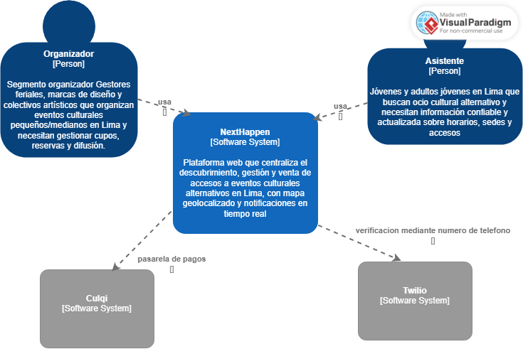
### 4.8.2. Software Architecture Container Diagrams
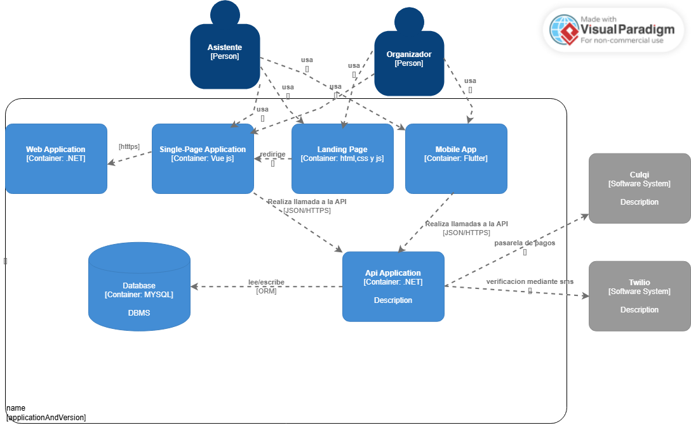
### 4.8.3. Software Architecture Components Diagrams
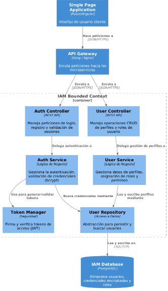
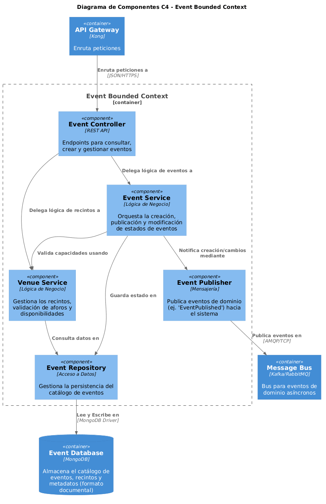
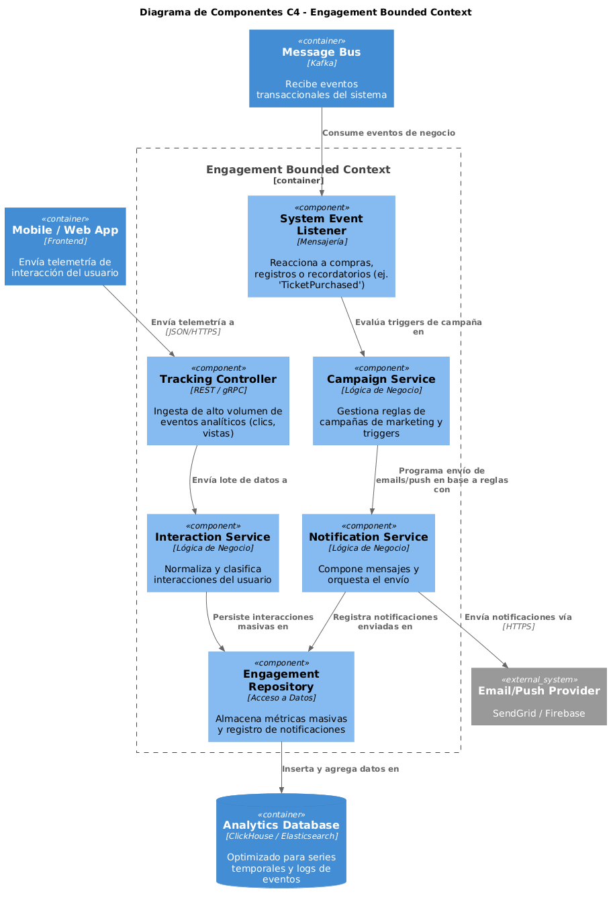
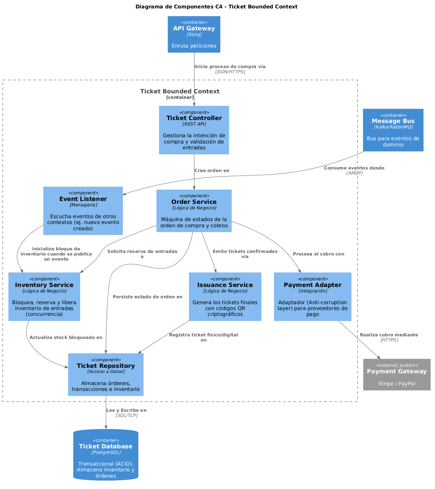
## 4.9. Software Object-Oriented Design

### 4.9.1. Class Diagrams
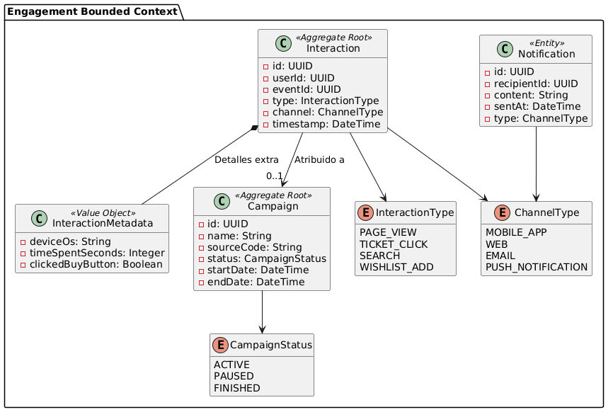
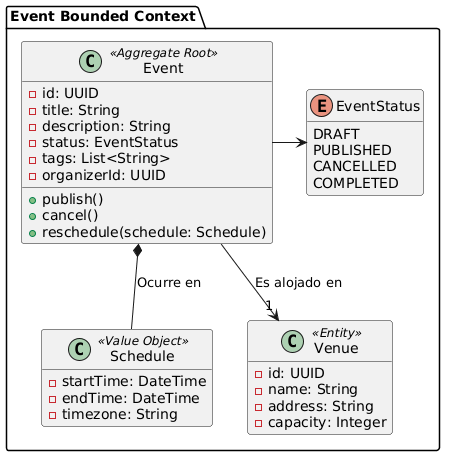
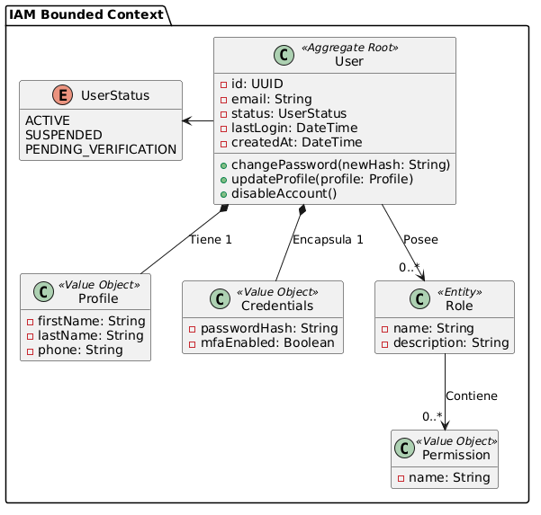
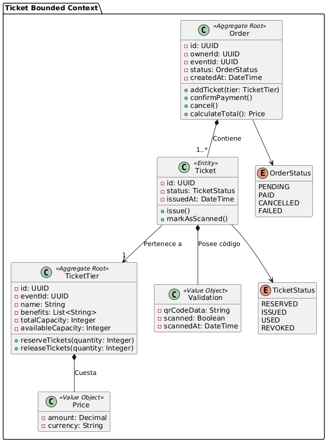
### 4.9.2. Class Dictionary

## 4.10. Database Design
### 4.10.1. Relational/Non-Relational Database Diagram
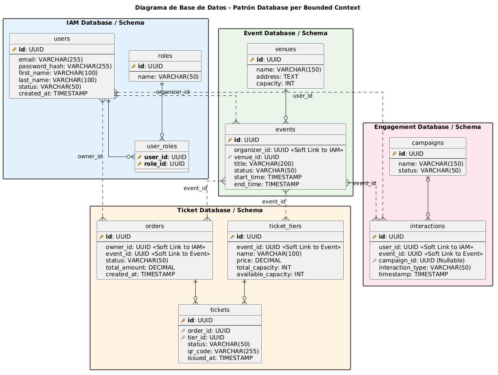
