# Capítulo V: Product Implementation

## 5.1. Software Configuration Management

### 5.1.1. Software Development Environment Configuration

### Requirements Management

**Product UX/UI Design**

**Figma:** Herramienta colaborativa de diseño que permitirá desarrollar los prototipos, wireframes y lineamientos visuales que definirán la interfaz de la plataforma.

Enlace de referencia: https://www.figma.com/

**PlantUML:** Herramienta que permitirá representar y generar diagramas UML, como diagramas de clases, a partir de una sintaxis basada en texto.

Enlace de referencia: https://plantuml.com/

### Software Development

**JetBrains Rider:** Entorno de desarrollo utilizado para la implementación del backend con **.NET**, aprovechando sus herramientas para el desarrollo, depuración y gestión del proyecto.

Enlace de referencia: https://www.jetbrains.com/rider/

**Android Studio:** Entorno de desarrollo empleado para la creación de la aplicación móvil utilizando **Flutter**, facilitando la implementación, ejecución y depuración de la aplicación.

Enlace de referencia: https://developer.android.com/studio

**JetBrains WebStorm:** Entorno de desarrollo utilizado para la construcción del frontend con **Vue.js**, proporcionando herramientas especializadas para el desarrollo y mantenimiento de la interfaz web.

Enlace de referencia: https://www.jetbrains.com/webstorm/

### Software Deployment

**Git:** Sistema utilizado para llevar el control de versiones del proyecto, registrar los cambios realizados y facilitar la colaboración durante el desarrollo de la **landing page**.

Enlace de referencia: https://git-scm.com/

**JetBrains Rider:** Entorno empleado para el desarrollo y mantenimiento del **backend**, utilizando **.NET** como tecnología principal.

Enlace de referencia: https://www.jetbrains.com/rider/

**Vercel:** Plataforma utilizada para realizar el **despliegue del frontend**, permitiendo publicar y mantener disponible la aplicación web.

Enlace de referencia: https://vercel.com/

### Software Documentation and Project Management

**GitHub:** Plataforma utilizada para almacenar y administrar el código fuente del proyecto, realizar el seguimiento de cambios y facilitar el trabajo colaborativo entre los integrantes del equipo.

Enlace de referencia: https://github.com/

### 5.1.2. Source Code Management

Para la gestión y control del código fuente del proyecto se utilizará GitHub, permitiendo centralizar el desarrollo y facilitar la colaboración entre los miembros del equipo. Asimismo, se dispondrá de un repositorio independiente para cada producto desarrollado. Los enlaces correspondientes se encuentran disponibles en la sección de anex

* **Organización en GitHub:** https://github.com/1ASI0732-2620-9095-Festora
* **Repositorio del informe final:** https://github.com/1ASI0732-2620-9095-Festora/next-happen-report
* **Repositorio de la Landing Page** https://github.com/1ASI0732-2620-9095-Festora/next-happen-landing-page
* **Repositorio de la Backend** https://github.com/1ASI0732-2620-9095-Festora/next-happen-backend
* **Repositorio de la Frontend** https://github.com/1ASI0732-2620-9095-Festora/next-happen-frontend
* **Repositorio de la Aplicacion mobile** https://github.com/1ASI0732-2620-9095-Festora/next-happen-mobile

#### Estrategia de ramificación

Para organizar el desarrollo y facilitar la gestión de los cambios, se adoptó **GitFlow** como estrategia de trabajo con ramas. Este modelo permite separar las tareas de desarrollo y mantener una estructura ordenada, haciendo más sencilla la colaboración entre los integrantes del equipo.

En el repositorio correspondiente al informe final se definieron las siguientes ramas:

- **dev:** Rama principal utilizada para integrar los avances, nuevas funcionalidades y correcciones realizadas durante el desarrollo.
- **chapter-1:** Rama destinada al desarrollo y actualización del contenido correspondiente al capítulo 1 del informe.
- **chapter-2:** Rama utilizada para trabajar en el contenido y modificaciones del capítulo 2.
- **chapter-3:** Rama destinada a la elaboración y actualización del capítulo 3.
- **chapter-4:** Rama utilizada para desarrollar y mantener el contenido correspondiente al capítulo 4.
- **chapter-5:** Rama destinada a la elaboración y actualización del capítulo 5.

#### Convención para los mensajes de commit

Para facilitar la identificación y comprensión de los cambios realizados en el proyecto, se utilizará la convención **Conventional Commits**. Esta metodología permite mantener un formato uniforme en los mensajes de commit y conocer rápidamente el propósito de cada modificación.

Algunos ejemplos de mensajes son:

- `feat: Add search by name functionality`
- `fix: Correct form validation error`
- `docs: Update installation instructions`
- `refactor: Simplify calculation logic`

Los principales tipos de commit y su finalidad serán los siguientes:

- **feat:** Se utiliza cuando se incorpora una nueva funcionalidad al sistema.
- **fix:** Indica la corrección de un error o comportamiento incorrecto.
- **docs:** Corresponde a modificaciones relacionadas únicamente con la documentación.
- **style:** Se emplea para cambios de formato o estilo que no modifican el funcionamiento del código, como espacios, indentación o punto y coma.
- **refactor:** Se utiliza para reorganizar o mejorar el código sin añadir funcionalidades nuevas ni solucionar errores.
- **test:** Corresponde a la creación, modificación o corrección de pruebas automatizadas.
- **chore:** Se aplica a tareas de mantenimiento relacionadas con herramientas auxiliares, configuración o procesos de compilación.

### 5.1.3. Source Code Style Guide & Conventions

En este apartado se establecen los criterios de estilo, nomenclatura y organización que seguirá el equipo durante la implementación del proyecto. Estas reglas buscan mantener un código uniforme, fácil de comprender y sencillo de mantener, independientemente del lenguaje o tecnología utilizada.

Las tecnologías consideradas para esta guía son **HTML5, CSS3, JavaScript, C# y Flutter/Dart**. Como criterio general, se utilizará el **inglés** para nombrar variables, métodos, clases, componentes, archivos y demás elementos relacionados con el código fuente.

#### Principios generales

- **Idioma del código:** Todos los identificadores utilizados en el código fuente deberán estar escritos en inglés, incluyendo nombres de clases, variables, funciones, métodos, archivos y componentes.

- **Legibilidad:** Se utilizarán nombres descriptivos que permitan comprender fácilmente la finalidad de cada elemento, evitando abreviaciones que puedan generar confusión.

- **Uniformidad:** El equipo mantendrá criterios de formato y nomenclatura consistentes en todos los repositorios y tecnologías empleadas.

- **Nombres según responsabilidad:** Los nombres de clases, componentes y entidades deberán representar conceptos del dominio, mientras que las funciones y métodos deberán expresar acciones o comportamientos.

- **Separación de responsabilidades:** Cada archivo, clase o componente deberá concentrarse en una responsabilidad específica siempre que sea posible.

- **Indentación:** Se utilizarán 2 espacios para HTML, CSS y JavaScript, mientras que en C# y Dart se utilizarán 4 espacios.

---

#### HTML5

Para la estructura de las interfaces web se seguirán las siguientes convenciones:

- Los archivos deberán utilizar la extensión `.html`.

- Se priorizará el uso de elementos semánticos como `header`, `nav`, `main`, `section`, `article` y `footer`.

- Las imágenes deberán incluir el atributo `alt` con una descripción apropiada.

- Cuando sea necesario mejorar la accesibilidad, se utilizarán atributos `aria-*`.

- Los valores de los atributos HTML deberán escribirse utilizando comillas dobles (`"`).

- Para los identificadores `id` se utilizará la convención `camelCase`.

- Los nombres de las clases HTML seguirán la convención `kebab-case`, por ejemplo: `user-profile` o `product-card`.

- La indentación será de 2 espacios para facilitar la lectura de la estructura del documento.

---

#### CSS3

Para la definición de estilos se aplicarán las siguientes reglas:

- Las hojas de estilos deberán utilizar la extensión `.css`.

- Los nombres de clases deberán seguir la convención `kebab-case`, por ejemplo: `main-header`, `product-card` y `login-form`.

- Los estilos relacionados con un mismo componente deberán mantenerse agrupados para facilitar su mantenimiento.

- Se evitará el uso excesivo de selectores complejos que dificulten la reutilización de los estilos.

- Los bloques de estilos podrán organizarse mediante comentarios cuando el tamaño de la hoja de estilos lo requiera.

- La indentación utilizada será de 2 espacios.

---

#### JavaScript

Para el código JavaScript se establecen las siguientes convenciones:

- Los archivos deberán utilizar la extensión `.js`.

- Los nombres de variables y funciones deberán utilizar `camelCase`, por ejemplo: `userName` y `getUserData()`.

- Las clases y componentes deberán utilizar `PascalCase`, por ejemplo: `UserProfile` y `LoginForm`.

- Se utilizará preferentemente `const` para valores que no serán reasignados y `let` cuando la variable necesite cambiar durante la ejecución.

- Se evitará el uso de `var`, salvo en situaciones donde exista una razón específica para utilizarlo.

- Se recomienda el uso de funciones flecha cuando contribuya a mantener un código más claro y conciso.

- Las funciones, variables y métodos deberán utilizar nombres descriptivos que indiquen claramente su propósito.

- Cada archivo deberá procurar mantener una responsabilidad concreta, evitando concentrar funcionalidades que pertenezcan a diferentes componentes.

Basado en:

- [Google JavaScript Style Guide](https://google.github.io/styleguide/jsguide.html)

---

#### C#

Para el desarrollo en C# se utilizarán las siguientes convenciones:

- Los archivos deberán tener la extensión `.cs`.

- Las clases, interfaces, componentes y demás tipos deberán utilizar `PascalCase`, por ejemplo: `UserService`, `OrderController` o `PaymentRepository`.

- Los métodos y propiedades deberán utilizar `PascalCase`, siguiendo las convenciones habituales de .NET, por ejemplo: `GetUserById()` o `UserEmail`.

- Las variables locales y parámetros deberán utilizar `camelCase`, por ejemplo: `userId` o `userEmail`.

- Las constantes deberán utilizar `PascalCase`, siguiendo las convenciones recomendadas para C#, por ejemplo: `MaxAttempts`.

- Se procurará mantener una clase pública principal por archivo para facilitar la organización y localización del código.

- Los tipos y miembros públicos importantes deberán contar con documentación mediante comentarios XML (`///`) cuando sea necesario documentar su propósito o comportamiento.

- Se mantendrá una indentación de 4 espacios.

Basado en:

- [C# Coding Conventions - Microsoft](https://learn.microsoft.com/en-us/dotnet/csharp/fundamentals/coding-style/coding-conventions)
- [.NET Design Guidelines - Microsoft](https://learn.microsoft.com/en-us/dotnet/standard/design-guidelines/)

---

#### Flutter y Dart

Para el desarrollo de aplicaciones utilizando Flutter se seguirán las convenciones recomendadas para el lenguaje Dart y el framework Flutter:

- Los archivos deberán utilizar la extensión `.dart`.

- Los nombres de clases y widgets deberán utilizar `PascalCase`, por ejemplo: `UserProfile`, `LoginScreen` o `ProductCard`.

- Los nombres de variables, métodos y funciones deberán utilizar `lowerCamelCase`, por ejemplo: `userName`, `getUserData()` o `calculateTotal()`.

- Los nombres de archivos deberán utilizar `snake_case`, por ejemplo: `user_profile.dart`, `login_screen.dart` o `product_card.dart`.

- Las constantes deberán utilizar `lowerCamelCase` cuando correspondan a identificadores constantes de Dart, por ejemplo: `maxAttempts` o `defaultTimeout`.

- Los widgets deberán diseñarse procurando mantener responsabilidades específicas y evitar componentes excesivamente grandes.

- Se recomienda dividir las interfaces complejas en widgets reutilizables para favorecer el mantenimiento y la reutilización del código.

- Se utilizará `const` siempre que sea posible para widgets y objetos inmutables, con el objetivo de mejorar la eficiencia y expresar explícitamente la inmutabilidad.

- Se evitará mantener lógica de negocio compleja directamente dentro de los widgets. Esta deberá separarse en las capas o componentes correspondientes de acuerdo con la arquitectura definida para el proyecto.

- La indentación será de 2 espacios, siguiendo las convenciones habituales del lenguaje Dart.

- Se utilizará el formateador oficial de Dart para mantener un formato consistente en el código.

Basado en:

- [Dart Style Guide](https://dart.dev/effective-dart/style)
- [Flutter Documentation](https://docs.flutter.dev/)
- [Effective Dart](https://dart.dev/effective-dart)

### 5.1.4. Software Deployment Configuration

#### Despliegue de la Landing Page mediante GitHub Pages

Para publicar la Landing Page se utilizará **GitHub Pages**, servicio que permite alojar sitios web estáticos directamente desde un repositorio. El proceso de publicación se realizará de la siguiente manera:

1. **Preparar la estructura del proyecto:**  
   Verificar que los archivos necesarios se encuentren correctamente organizados. Como mínimo, se deberá contar con:
    - `index.html`: archivo principal de la página.
    - `style.css`: hoja de estilos utilizada para definir la presentación visual.
    - `img/`: directorio destinado a almacenar los recursos gráficos e imágenes.

2. **Subir el contenido al repositorio:**  
   Incorporar los archivos de la Landing Page al repositorio correspondiente y registrar los cambios mediante un commit.

3. **Configurar GitHub Pages:**  
   Acceder a la sección `Settings` del repositorio y seleccionar la opción `Pages`. En la configuración de despliegue se deberá elegir la rama `main` como fuente y establecer `/(root)` como directorio de publicación.

4. **Aplicar la configuración:**  
   Guardar los cambios realizados y esperar a que GitHub ejecute automáticamente el proceso de construcción y publicación del sitio.

5. **Verificar la publicación:**  
   Una vez finalizado el despliegue, GitHub Pages habilitará una dirección web pública desde la cual se podrá acceder a la Landing Page.

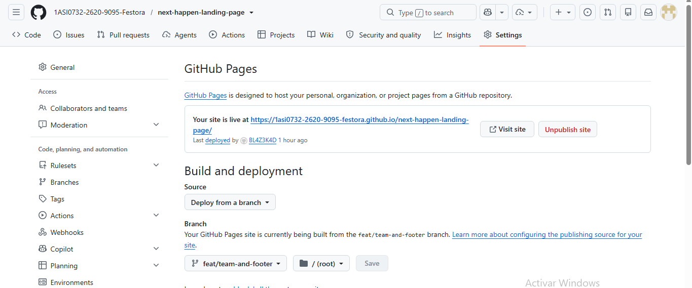
Link de la landing desplegada: https://1asi0732-2620-9095-festora.github.io/next-happen-landing-page/

## 5.2. Product Implementation & Deployment

### 5.2.1. Sprint Backlogs

| User Story ID | User Story | WorkItem ID | WorkItem / Task | Description | Estimation (Hours) | Assigned To | Status |
|---|---|---|---|---|---:|---|---|
| US01 | Acceso a la app | TK01 | Diseño de acceso desde landing | Diseñar el botón y enlace que permita al usuario acceder a la aplicación desde la landing page. | 1 | Alison Arrieta | Done |
| | | TK02 | Implementación del acceso | Implementar la navegación desde la landing hacia la aplicación y validar su funcionamiento. | 1 | Yazid Said | Done |
| US02 | Cambio idioma landing | TK03 | Diseño del selector de idioma | Diseñar un selector de idioma visible y accesible dentro de la landing page. | 1 | Gabriel Rivera | Done |
| | | TK04 | Implementación del cambio de idioma | Implementar la funcionalidad para cambiar los textos principales de la landing entre los idiomas disponibles. | 1.5 | Gonzalo Carhuancote | Done |
| US03 | Navegación responsive | TK05 | Diseño responsive | Adaptar el diseño de la landing para dispositivos móviles, tablets y computadoras. | 1.5 | Gabriel Mamani | Done |
| | | TK06 | Pruebas responsive | Validar la correcta visualización y navegación de la interfaz en diferentes tamaños de pantalla. | 1 | Alison Arrieta | Done |
| US04 | Contenido visual | TK07 | Diseño de sección de eventos | Diseñar una sección visual para mostrar imágenes representativas de los eventos disponibles. | 1 | Yazid Said | Done |
| | | TK08 | Integración de imágenes | Integrar imágenes de eventos y validar su correcta visualización dentro de la plataforma. | 1 | Gabriel Rivera | Done |
| US05 | Redes sociales | TK09 | Diseño de enlaces sociales | Diseñar la sección de redes sociales dentro de la landing page. | 0.5 | Gonzalo Carhuancote | Done |
| | | TK10 | Integración de enlaces | Agregar los enlaces hacia las redes sociales oficiales y validar su funcionamiento. | 0.5 | Gabriel Mamani | Done |
| US06 | Búsqueda por filtros | TK11 | Diseño de filtros de búsqueda | Diseñar los controles para filtrar eventos por categoría, fecha y ubicación. | 2 | Gabriel Rivera | Done |
| | | TK12 | Implementación de filtros | Implementar la funcionalidad de filtrado y validar los resultados obtenidos según los criterios seleccionados. | 3 | Alison Arrieta | Done |
| US08 | Detalle del evento | TK13 | Diseño del detalle del evento | Diseñar la vista donde se mostrará la información completa de un evento. | 1.5 | Yazid Said | Done |
| | | TK14 | Implementación del detalle | Implementar la vista de detalle mostrando nombre, descripción, fecha, ubicación y demás información del evento. | 2 | Gabriel Mamani | Done |
| US07 | Mapa interactivo | TK15 | Integración del mapa | Integrar un mapa interactivo para visualizar la ubicación de los eventos. | 2 | Gonzalo Carhuancote | Done |
| | | TK16 | Marcadores de eventos | Mostrar marcadores correspondientes a la ubicación de los eventos y validar su interacción. | 2 | Gabriel Rivera | Done |

Link del trello: https://trello.com/invite/b/6aa8494c6cbeeeb99e64e685/ATTI6ed74010fb6f4c4df8750006c40fb620C154EB0F/exp
### 5.2.2. Implemented Landing Page Evidence
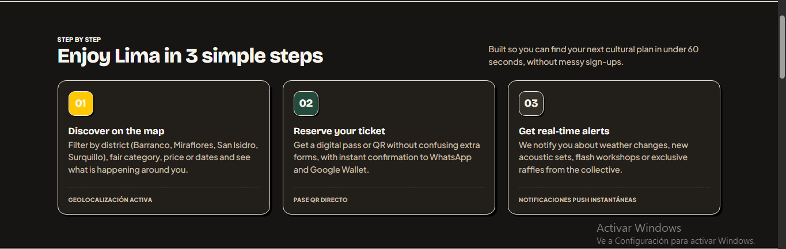
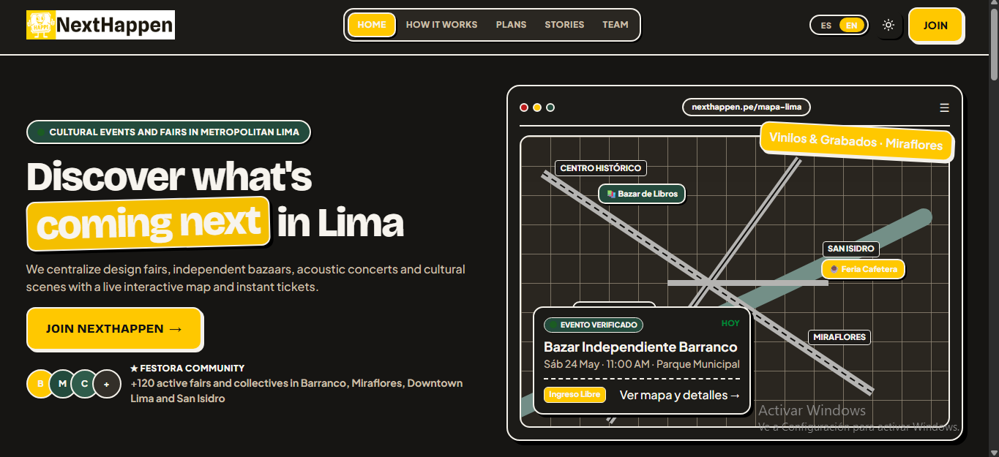
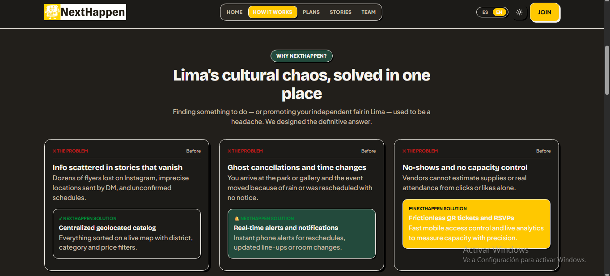
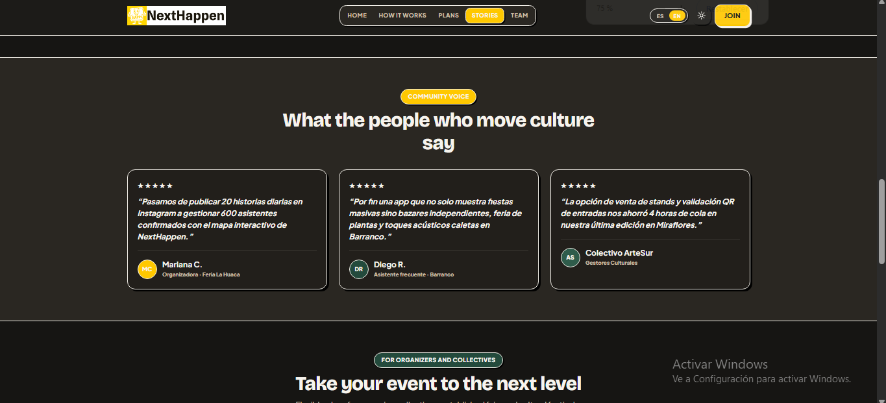
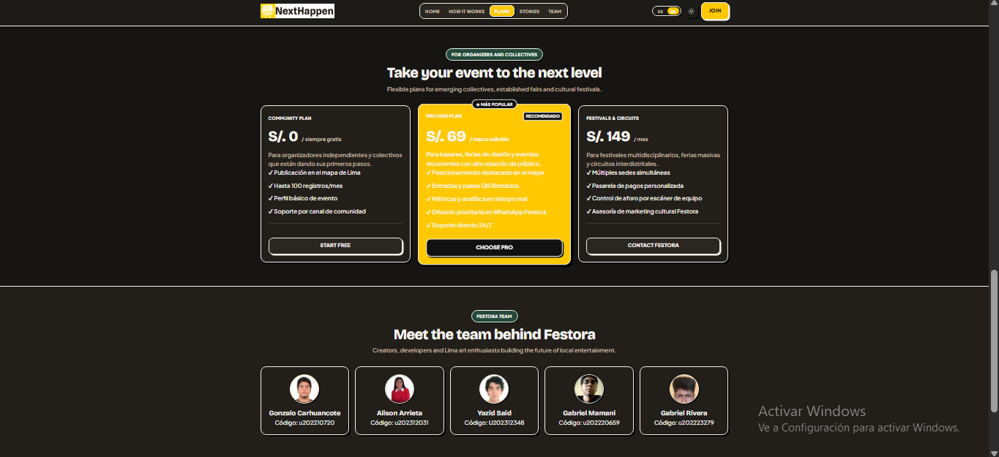
### 5.2.3. Implemented Frontend-Web Application Evidence
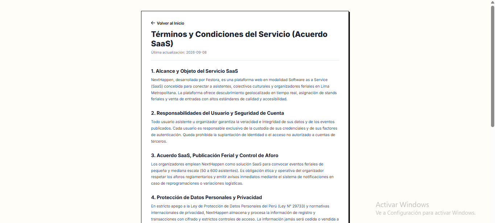
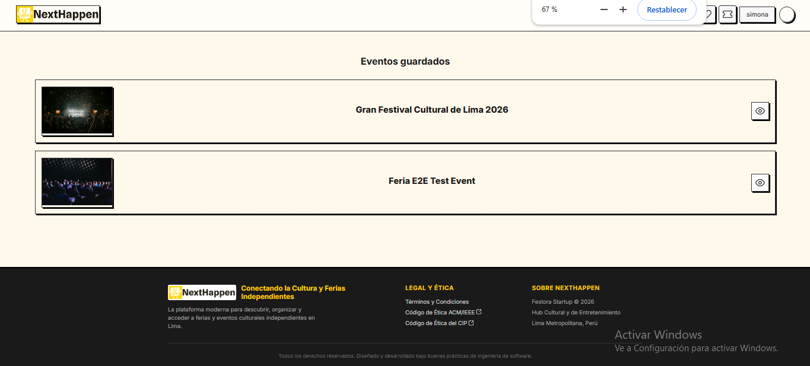
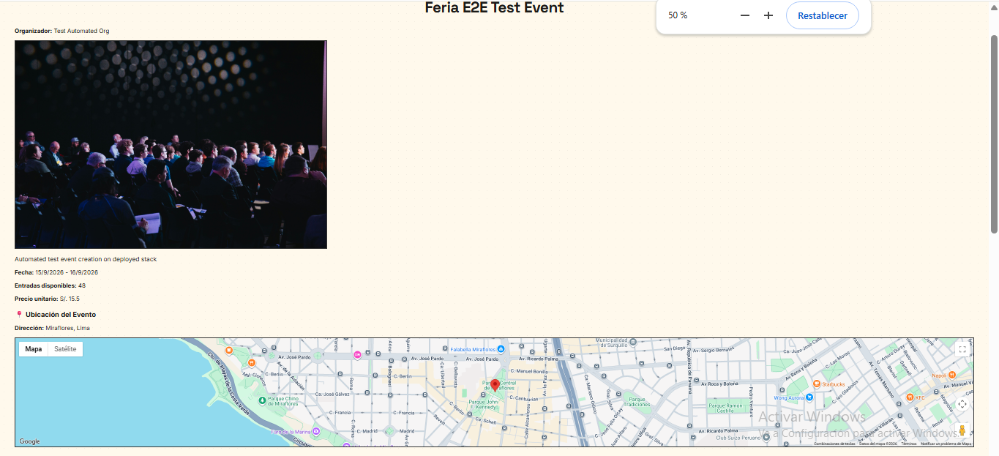
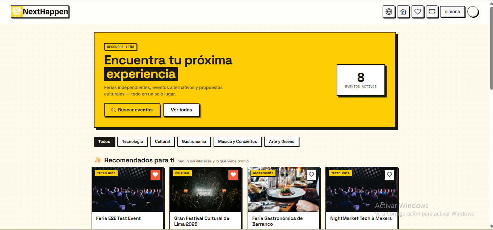
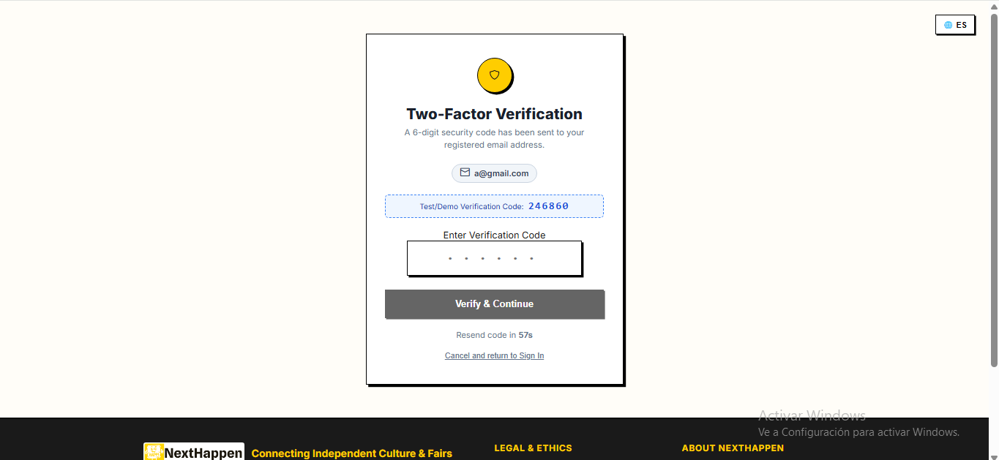
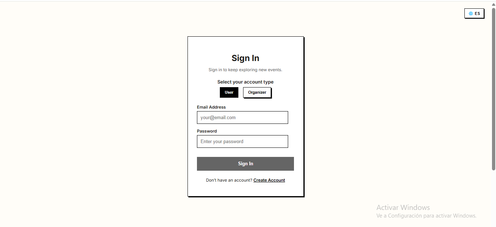
### 5.2.4. Implemented Native-Mobile Application Evidence

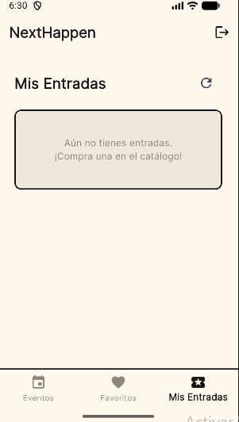
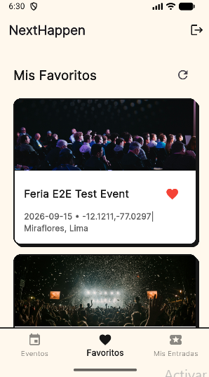
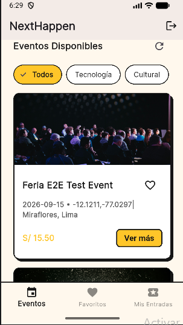
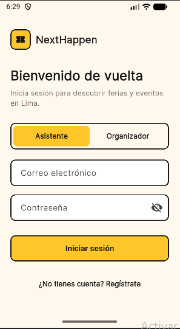

### 5.2.5. Implemented RESTful API and/or Serverless Backend Evidence
Para el bakcend de next happend se opto por una arquitectura de monolito.Asimismo, se identificaron los modulo necesarios del sistema para posteriermente desarrollarlo en el framework  de .NET. A continuación se presentan las evidencias de la implementación del backend:

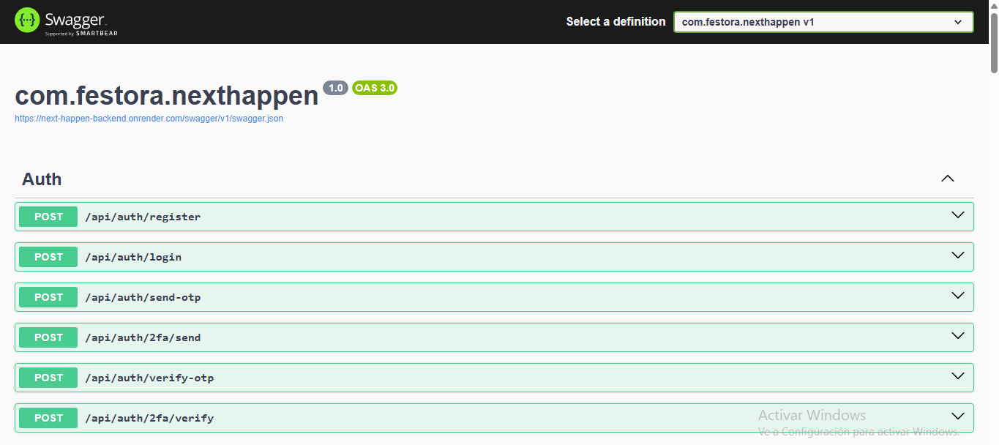
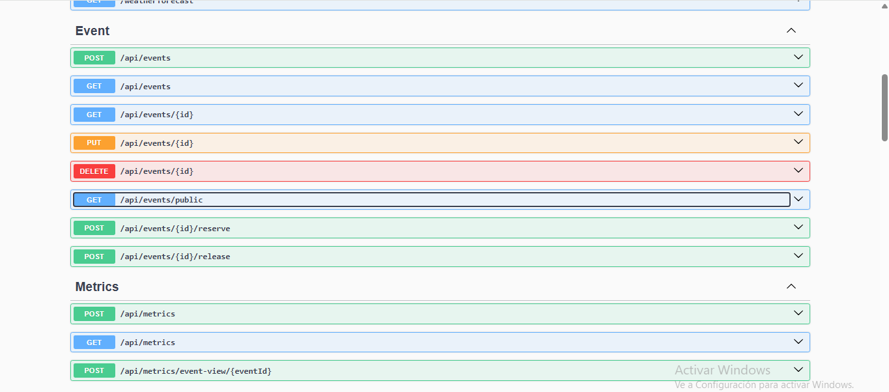
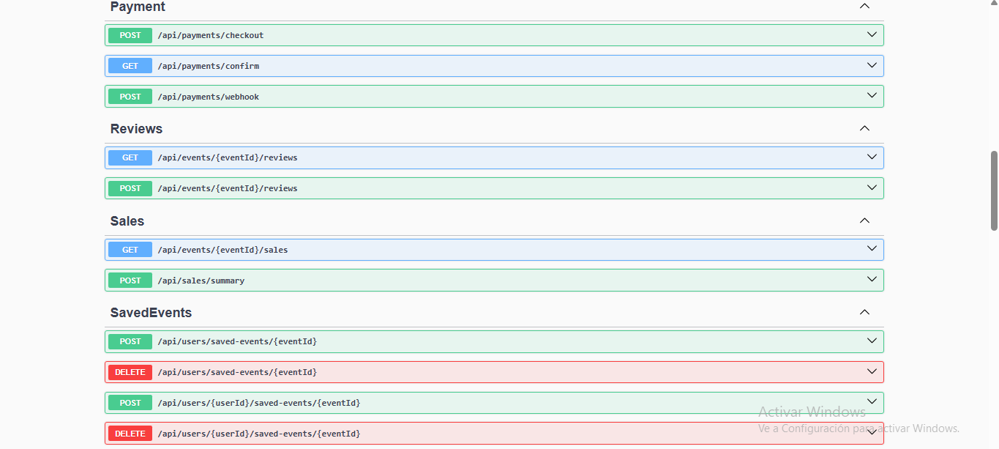
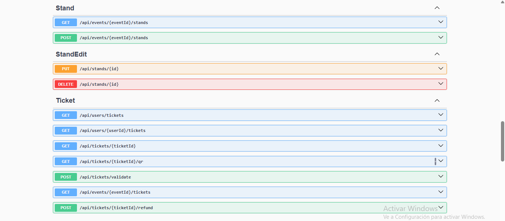

### 5.2.6. RESTful API documentation

Para documentar y facilitar el consumo de nuestra API REST se utiliza **Swagger basado en OpenAPI**, integrado dentro de la aplicación desarrollada con **ASP.NET Core**.

Esta herramienta permite centralizar y mantener actualizada la documentación de los servicios disponibles. Entre sus principales ventajas se encuentran:

- **Generación automática de la documentación:** La información de los endpoints, parámetros, modelos de datos y posibles respuestas se obtiene directamente de la implementación de la API y de los controladores asociados a los diferentes Bounded Contexts, como **IAM, Event, Engagement y Ticket**.

- **Swagger UI:** Durante el desarrollo, la documentación puede consultarse desde una interfaz web disponible en la ruta `/swagger`. Desde este espacio, los desarrolladores pueden revisar los endpoints disponibles, consultar los parámetros requeridos y verificar los mecanismos de autenticación, incluyendo el uso de **tokens JWT**.

- **Pruebas de endpoints:** Swagger UI permite ejecutar solicitudes directamente desde el navegador, lo que facilita la validación de los servicios y reduce el tiempo necesario para realizar pruebas e integración con el frontend.

De esta manera, Swagger sirve como un punto de referencia común para los desarrolladores y facilita la comunicación entre las diferentes partes del sistema.
### 5.2.7. Team Collaboration Insights

## 5.3. Video About-the-Product
